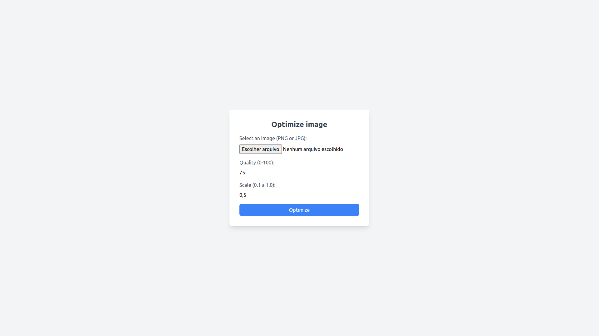

# Image Optimizer

  

 

Simple web app to optimize images. This app uses the main logic that I developed [here](https://github.com/mayraamaral/image-optimizer).
## Deploy
🔗 [Link](https://image-optimizer-f885de1c8e9a.herokuapp.com/)
## Tech Stack
- Programming Language: Python 3.10.12;
- Framework: Django 5.1.2;
- Styling: Tailwind CSS (CDN);
- Containerization: Docker;
- Deploy: Heroku.